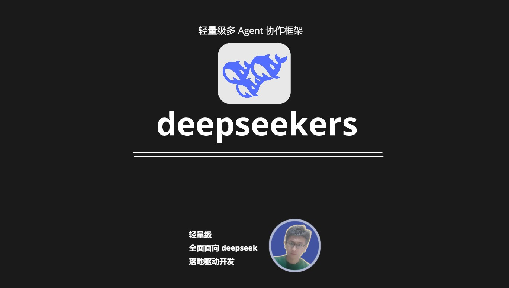

# deepseekers(标准版)



轻量级多 Agent 协作 AI Agent 框架(标准版)

初始化 client 在项目中，提供了对于 deepseek API 的封装方便大家快速接入 deepseek 模型

```python
from deepseekers.core import DeepSeekClient
client = DeepSeekClient(name="deepseek-chat")
```